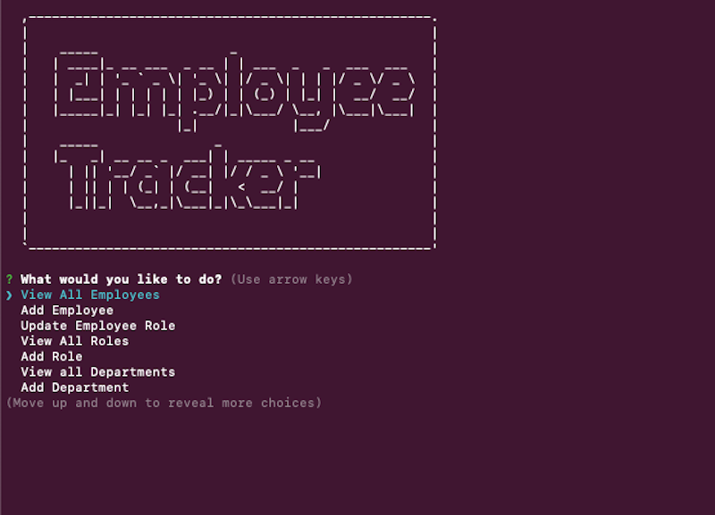

# Employee Tracker
This site was developed with the intention of creating an command-line application that allows a business owner to organize, view, and manage the departments, roles, and employees within their organization. 

## Motivation
The motivation behind this project was to create a CLI that utilitizes Node.js, Inquirer, and MySql to allow users to add, view, and update information in a database using the following schema:

## Tech/Framework Used
* Node.js
* MySQL
* Inquirer
* Javascript
* Console.table
* Asciiart-logo
* Built with Visual Code Studio

## Code Example
Here is an example of the Employee-Tracker application:

## Features
* Add departments, roles, employees
* View departments, roles, employees
* Update employees

## Installation
Clone this repository to your machine or download zip file.

## Usage
After the repository has been cloned, use terminal to change directories into "Employee-Tracker" folder. Run the command "node index.js", then follow prompts.

## License 

> You can reference the full license [here](https://github.com/Picke1id/Employee-Summary/blob/master/LICENSE).

This project is licensed under the terms of the MIT license.

## Link
* Video demonstration link: ()
